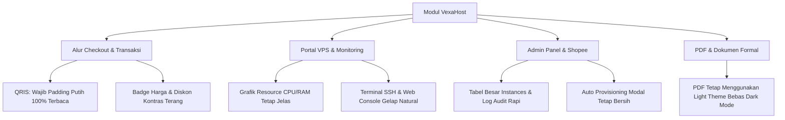

# Blueprint & Roadmap Implementasi Dark Mode: VexaHost

Dokumen ini merinci seluruh kebutuhan teknis, arsitektur CSS, tahapan refactoring, serta protokol pengujian untuk mengimplementasikan fitur **Light & Dark Mode** pada proyek utama (`vexahost`) agar hasilnya maksimal, elegan, dan **100% bebas bug/regresi visual**.

---

## 1. Analisis Arsitektur Saat Ini

| Parameter | Kondisi Saat Ini di `vexahost` | Target Implementasi |
| :--- | :--- | :--- |
| **Framework CSS** | Tailwind CSS v4 (`@import "tailwindcss";`) | Tailwind CSS v4 dengan `@custom-variant dark` |
| **Konfigurasi Tema** | Tidak ada token dark mode di `app.css` | Token semantik adaptif (Slate/Zinc palette) |
| **Jumlah Blade View** | ~140 file Blade | 100% komponen memiliki adaptasi `dark:` |
| **State Persistence** | Tidak ada | `localStorage.theme` + System Preference Detection |
| **FOUC Protection** | Belum ada script pencegah flicker | Inline Critical CSS & Script di `<head>` (Zero Flash) |
| **Dokumen Cetak** | Default putih | Invoice PDF tetap Light Mode (print-friendly) |

---

## 2. Fondasi Inti (Core Engine & CSS)

### A. Tailwind CSS v4 Custom Variant
Pada [resources/css/app.css](file:///d:/Project%20-%20VexaHost/vexahost/resources/css/app.css), Tailwind v4 membutuhkan custom variant agar utilitas `dark:` aktif berdasarkan class `.dark` pada tag `<html>`:
```css
@import "tailwindcss";

@custom-variant dark (&:where(.dark, .dark *));

@theme {
  --color-primary: #4A6FA5;
  --color-primary-dark: #3A5B88;
  --color-primary-light: #6588BC;
  
  /* Semantic Surface Tokens untuk Dark Mode (Pure Black / Neutral Zinc) */
  --color-surface-light: #ffffff;
  --color-surface-dark: #09090b;        /* Zinc-950 / Pure Black Canvas */
  --color-surface-card-dark: #18181b;   /* Zinc-900 / Dark Card Surface */
  --color-border-dark: #27272a;         /* Zinc-800 / Neutral Dark Border */
  --color-text-primary-dark: #fafafa;   /* Zinc-50 */
  --color-text-muted-dark: #a1a1aa;     /* Zinc-400 */
}
```

### B. Anti-Flicker (Zero FOUC) di Master Layout
Diterapkan pada 4 master layout:
- `resources/views/layouts/app.blade.php` (Publik / Landing / Produk)
- `resources/views/layouts/dashboard.blade.php` (Portal Klien VPS)
- `resources/views/layouts/admin.blade.php` (Panel Admin)
- `resources/views/layouts/auth.blade.php` (Login & Registrasi)

Di dalam tag `<head>` sebelum stylesheet Vite:
```html
<script>
    (function() {
        var theme = localStorage.getItem('theme');
        var isDark = theme === 'dark' || (!theme && window.matchMedia('(prefers-color-scheme: dark)').matches);
        if (isDark) {
            document.documentElement.classList.add('dark');
            document.documentElement.style.colorScheme = 'dark';
        } else {
            document.documentElement.classList.remove('dark');
            document.documentElement.style.colorScheme = 'light';
        }
    })();
</script>

<style>
    [x-cloak] { display: none !important; }
    html.dark { color-scheme: dark; background-color: #09090b; }
    html.dark body { background-color: #09090b; color: #fafafa; }
</style>
```

> [!IMPORTANT]
> Jangan menambahkan class `transition-colors duration-300` secara permanen pada tag `<body>`. Animasi transisi yang menempel di `<body>` akan menyebabkan browser merender kedipan putih selama 300ms setiap kali halaman berpindah rute.

---

## 3. Komponen Pengalih Tema (Theme Toggle)

Tombol toggle ditempatkan di:
1. **Header Bilah Atas Desktop**: Di samping profil avatar.
2. **Sidebar Mobile**: Di bagian footer drawer menu.

```html
<button @click="toggleTheme()" 
        type="button"
        class="p-2 rounded-lg text-slate-500 hover:text-slate-900 dark:text-zinc-400 dark:hover:text-white hover:bg-slate-100 dark:hover:bg-zinc-800 transition-colors focus:outline-none"
        title="Ganti Tema">
    <svg x-show="!$store.theme.dark" class="w-5 h-5 text-slate-600" fill="none" stroke="currentColor" viewBox="0 0 24 24">
        <path stroke-linecap="round" stroke-linejoin="round" stroke-width="2" d="M20.354 15.354A9 9 0 018.646 3.646 9.003 9.003 0 0012 21a9.003 9.003 0 008.354-5.646z"/>
    </svg>
    <svg x-show="$store.theme.dark" x-cloak class="w-5 h-5 text-amber-400" fill="none" stroke="currentColor" viewBox="0 0 24 24">
        <path stroke-linecap="round" stroke-linejoin="round" stroke-width="2" d="M12 3v1m0 16v1m9-9h-1M4 12H3m15.364 6.364l-.707-.707M6.343 6.343l-.707-.707m12.728 0l-.707.707M6.343 17.657l-.707.707M16 12a4 4 0 11-8 0 4 4 0 018 0z"/>
    </svg>
</button>
```

Logika Javascript pendukung:
```javascript
function toggleTheme() {
    const isDark = document.documentElement.classList.toggle('dark');
    document.documentElement.style.colorScheme = isDark ? 'dark' : 'light';
    localStorage.setItem('theme', isDark ? 'dark' : 'light');
    window.dispatchEvent(new CustomEvent('theme-changed', { detail: { isDark } }));
}
```

---

## 4. Standarisasi Komponen Visual (Design System)

Agar tidak ada kontras teks yang rusak (*black text on black background*), seluruh komponen wajib distandarisasi dengan palet **Pure Black / Neutral Zinc** (bukan biru):

### A. Kartu Konten & Surface
- **Container Dasar**: `bg-white dark:bg-zinc-900 border border-slate-200 dark:border-zinc-800 text-slate-900 dark:text-zinc-100`
- **Sub-Card / Wells**: `bg-slate-50 dark:bg-zinc-950/60 border border-slate-200/80 dark:border-zinc-800/80`

### B. Form Controls (Input, Select, Textarea)
- **Input Field**: `bg-white dark:bg-zinc-950 border-slate-300 dark:border-zinc-800 text-slate-900 dark:text-zinc-100 placeholder:text-slate-400 dark:placeholder:text-zinc-500 focus:border-primary dark:focus:border-primary`
- **Checkboxes & Radios**: `text-primary bg-white dark:bg-zinc-950 border-slate-300 dark:border-zinc-700`

### C. Tabel Data & Data Grid
- **Header Kolom (`<th>`)**: `bg-slate-50 dark:bg-zinc-950/80 text-slate-600 dark:text-zinc-400 border-b border-slate-200 dark:border-zinc-800`
- **Baris Tabel (`<tr>`)**: `divide-slate-200 dark:divide-zinc-800 hover:bg-slate-50/70 dark:hover:bg-zinc-800/40 text-slate-800 dark:text-zinc-200`
- **Pagination**: Pastikan link `previous`/`next` dan nomor halaman memiliki border dan teks yang kontras di tema gelap.

### D. Status Badges & Pills
- **Success (Active / Deal / Paid)**: `bg-emerald-50 text-emerald-700 border-emerald-200` $\rightarrow$ `dark:bg-emerald-950/40 dark:text-emerald-400 dark:border-emerald-800/50`
- **Warning (Pending / Expiring)**: `bg-amber-50 text-amber-700 border-amber-200` $\rightarrow$ `dark:bg-amber-950/40 dark:text-amber-400 dark:border-amber-800/50`
- **Danger (Suspended / Overdue)**: `bg-rose-50 text-rose-700 border-rose-200` $\rightarrow$ `dark:bg-rose-950/40 dark:text-rose-400 dark:border-rose-800/50`
- **Neutral (Closed / Info)**: `bg-slate-100 text-slate-700 border-slate-200` $\rightarrow$ `dark:bg-zinc-800 dark:text-zinc-300 dark:border-zinc-700`

---

## 5. Area Khusus & Aturan Perlindungan Sistem



### 1. Dynamic QRIS Code (Crucial UX)
> [!CAUTION]
> Gambar QR Code atau SVG Dynamic QRIS **tidak boleh di-invert warnanya** dan **wajib dibungkus kartu putih** dengan padding minimal `qris-light-box p-4 bg-white dark:bg-white rounded-xl`. Jika QR code berubah menjadi latar gelap atau terbalik (warna putih di latar hitam), scanner m-banking (BCA, Mandiri, BRI, GoPay, OVO, ShopeePay) akan gagal membaca kode QR.

### 2. PDF Invoice & Bukti Pembayaran
File cetak PDF yang di-generate via Snappy / DomPDF pada controller tagihan memiliki layout CSS statis light mode sendiri (`invoice-pdf.blade.php` & `invoice-print.blade.php` dengan `.light-isolated`), terisolasi penuh dari kelas `dark:`.

### 3. Monitoring Charts (Chart.js / SVG Graphs)
Garis grafik CPU, Memory, dan Bandwidth pada halaman rinci instance menyesuaikan warna grid garis:
- Light: Grid lines `#e2e8f0`, Labels `#64748b`
- Dark: Grid lines `#27272a`, Labels `#a1a1aa`

---

## 6. Pembagian Tahap Kerja (Execution Checklist)

- [x] **Tahap 1: Persiapan Fondasi Core**
  - Pasang `@custom-variant dark (&:where(.dark, .dark *));` di `app.css`.
  - Pasang inline theme script & critical CSS (`#09090b`) di 4 master layouts.
  - Tambahkan tombol ganti tema di header layout.
- [x] **Tahap 2: Master Layouts Shell**
  - Modifikasi `layouts/admin.blade.php`: sidebar, header, dropdown profil.
  - Modifikasi `layouts/dashboard.blade.php`: sidebar, header, dropdown profil.
  - Modifikasi `layouts/app.blade.php`: navbar landing page dan footer.
  - Modifikasi `layouts/auth.blade.php`: halaman login dan registrasi.
- [x] **Tahap 3: Halaman Publik & Landing Page**
  - Halaman Beranda (`landing.blade.php`).
  - Halaman Paket Cloud VPS, Dedicated, Database, dan AI Agent (`pages/produk.blade.php`).
  - Halaman Status Layanan (`pages/status.blade.php`), Dokumentasi, dan Legal.
- [x] **Tahap 4: Alur Checkout & Pembayaran**
  - Halaman checkout paket (`order/checkout.blade.php`).
  - Modal / Card Dynamic QRIS (`.qris-light-box`) dan Instruksi Virtual Account (`order/payment-gateway.blade.php`).
  - Halaman Status Order dan Konfirmasi Sukses.
- [x] **Tahap 5: Portal Dashboard Pelanggan**
  - Daftar instances VPS & kartu ringkasan.
  - Halaman detail instance VPS & tombol power action.
  - Riwayat tagihan, detail invoice, dan tiket bantuan.
- [x] **Tahap 6: Admin Panel (Semua Modul)**
  - Ringkasan statistik & metrik server.
  - Manajemen instances cloud & provisioning.
  - Modul integrasi Shopee & pemrosesan otomatis.
  - Billing center, monitoring node, dan audit log.
- [x] **Tahap 7: Quality Assurance & Automated Testing**
  - Jalankan seluruh 408 tests di `vexahost` (`php artisan test`).
  - Uji kontras warna teks di seluruh form input & tabel.
  - Pastikan nihil flicker saat berganti menu.

